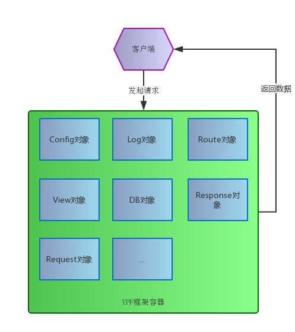

ypf
======

> you know, yet php framework~

> written in [zephir](https://zephir-lang.com) and built as a PHP extension.


architecture
-------------


Main features:

你可以把任意对象注册到YPF框架的容器中。在请求生命周期内，容器内的对象保持全局单例模式。

* MVC

* ROUTE

* CONFIG

* DB

Requirements
------------

To compile ypf as PHP extension:

* [zephir](https://zephir-lang.com)

* [php 5.5+](http://www.php.net)


Installation
------------

* clone this project

* install zephir

* compile the extension:

    ```
    zephir build
    ```
* restart php | php-fpm

External Links
--------------
* [Zephir Documentation](https://zephir-lang.com/)


License
-------
Ypf is open-sourced software licensed under the MIT License. See the LICENSE file for more information.


Demo
-------

一个使用Ypf扩展作为php框架的演示系统: [ypf-demo](https://git.oschina.net/xuanskyer/ypf-demo.git)

TODO
-------

* 添加框架说明手册

* 优化错误异常处理

* 兼容PHP7